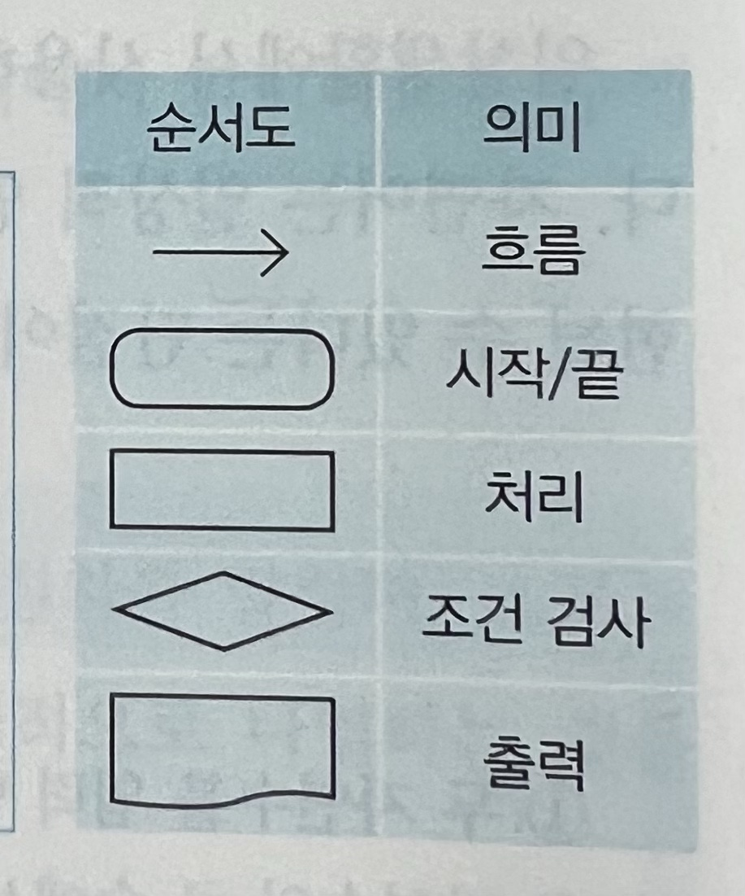
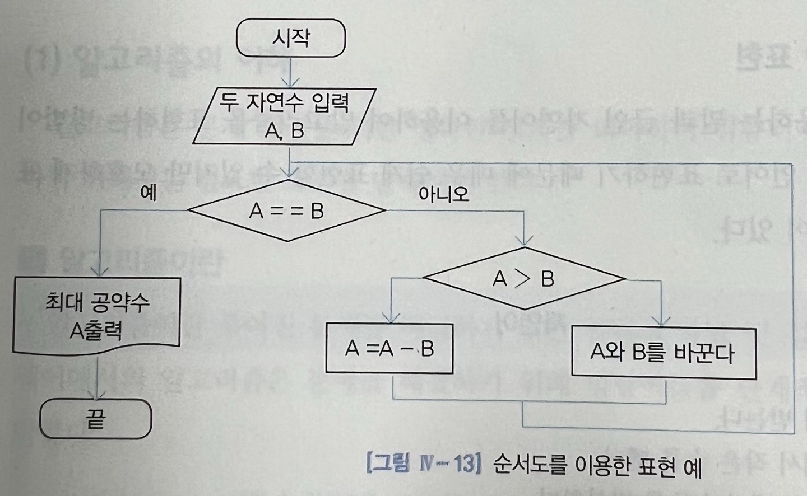

# 알고리즘의 구조

## 명확성
* 명령어들은 단순, 명확해야 한다.

## 입력
* 외부에서 자료가 주어질 수도 있고, 입력되는 값이 없을 수도 있다.

## 출력
* 적어도 하나 이상의 결과를 내야 한다.

## 유한성
* 알고리즘을 수행했을 때, 유한 번의 수행 후에 마쳐야 한다.

## 수행 가능성
* 실행이 되어야 한다.

# 알고리즘을 표현하는 여러가지 방법

## 자연어를 이용한 표현
* 자연어 : 일상생활에서 쓰는 말이나 글
* 장점 : 일상적 언어이기 때문에 쉽게 표현 가능
* 단점 : 모호하게 표현될 수 있음

### 표현 예시
	1. 두 자연수를 입력 받는다
	2. 자연수의 큰 수에서 작은 수를 뺀다
	3.더 이상 뺄 수 없을 때까지 2번을 반복한다
	4.만약 두 수 값이 같아지면 그 값이 처음 두 자연수의 최대 공약수이다


## 의사 코드를 이용한 표현
* 프로그래밍 언어와 유사한 방식
* 장점 : 자연어보다 간략하게 표현 가능, 프로그래밍 언어로 바꾸기 쉬움
* 단점 : 컴퓨터로는 실행이 불가함

### 표현 예시
```
INPUT A,B
WHILE(A!=B)
    IF(A>B)
        A⬅️A-B
    ELSE
        SWAP A,B
PRINT A,B
```

### 순서도를 이용한 표현
* 미리 약속된 도형과 흐름선을 이용하여 표현
* 특징 : 전체적인 흐름을 단계적으로 표현해 알고리즘 절차를 쉽게 파악할 수 있고 논리적인 오류나 정확성을 쉽게 분석할 수 있다


### 추가 도형
* 사다리꼴 : 입력

### 표현 예시



## 프로그래밍 언어를 이용한 표현
* 컴퓨터에서 직접적으로 수행이 가능한 프로그래밍 언어를 이용해 표현

표현 예시
```c
#include <stdio.h>
int main(){
    int A, B, Temp;
    scanf(“%d %d”, &A, &B);
    while(A!=B) {
        if (A>B) {
            A=A-B;
        }
        else {
            Temp = A;
	        A=B;
            B=Temp;
        }
    }
    printf(“최대 공약수 : %d”, A)
    
    return 0;
}
```